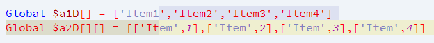
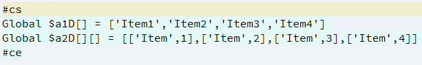
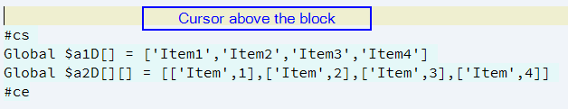
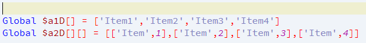

### Current
v 0.10
### About
The block comment (internal: box comment) in SciTE cannot be toggled.
I have now created a script that helps. It works with any file type for which the corresponding entries in the properties are created. For toggeling its required to detect, what the user want to do.
#### Set the comment block
- Some text must selected (at minimum one character)
- Starts and/or ends the selection inside of a line, the selection will expanded to full line.
- Ends the selection in a line with text, but at line start position so will this line ignored!
- Leading and trailing empty lines in selection will ignored!

Selection



After calling the hotkey



#### Unset the comment block
- NEW:
NONE SELECTION IS REQUIRED!
There must exist an comment block near the cursor position (cursor inside the .start line or above).
The script detects automatically the "comment.box.start" and the corresponding "comment.box.end" (also if nested) and works until this line.

Set cursor to unselect



After calling the hotkey



#### Required entries for ``SciTEUser.properties``
It is recommended to write all block comment settings into "SciTEUser.properties". The setting "comment.box.end.au3" from "SciTEGlobal.properties" is incorrect and must be corrected.
```properties
comment.box.start.au3=#cs
#~ If you want characters or tab in each line of comment block (middle lines), define it here.
#~ If TAB should used as box.middle, set it so: comment.box.middle.au3=@Tab
#~ "@Tab" is replaced by a tabulator by the script.
comment.box.middle.au3=
comment.box.end.au3=#ce
```

Additional [optional] property:
```properties
#~ message for comment block set or unset - output/none (1/0), default=0 (none output)
#~ e.g.: "++ COMMENT BLOCK - UNSET [line 103-106]"
#~ SET  : current line numbers of commented text including the lines with .start .end
#~ UNSET: current line number(s) of text that was commented
comment.box.output=0
```
#### Connection to SciTE
Search a free command number. Use a Hotkey of your choice.
If you have declared an option for user lua scripts (e.g.: "Lua.User.Scripts.Path=C:\code\lua"), copy the script to this folder.
Otherwise copy it to a folder of your choice and change the path in the command: "dofile". But backslashes in the path must be masked. ("\\\\"). If your path has spaces don't forgot to encapsulate in string delimiters.
```properties
# 36 Toggle Block Comment
command.name.36.*=Toggle Block Comment
command.36.*=dofile $(Lua.User.Scripts.Path)/BlockComment.lua
command.mode.36.*=subsystem:lua,savebefore:no
command.shortcut.36.*=Ctrl+Alt+F10
```
